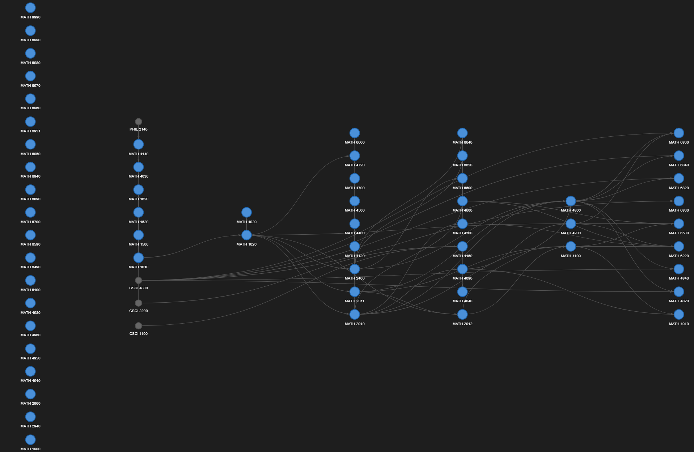
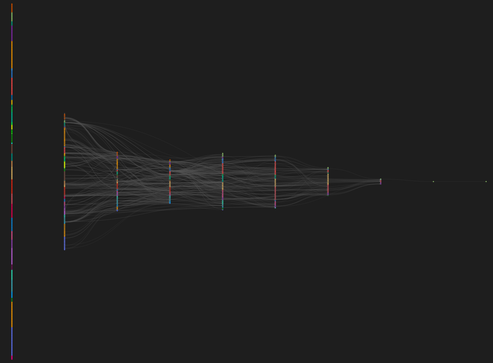
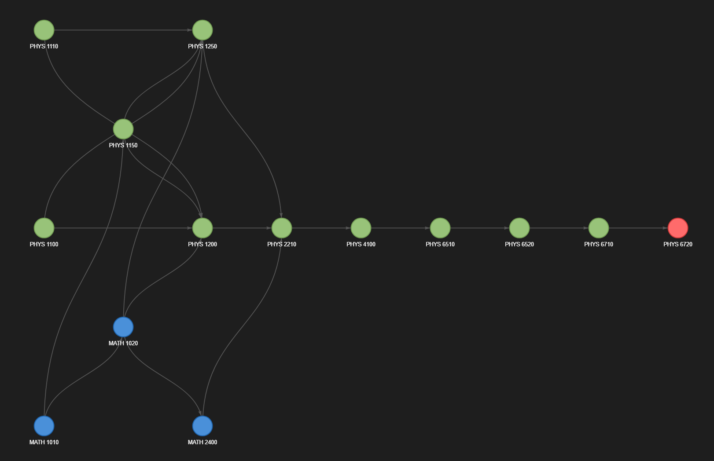

# Topological Course Graph

A Python program that scrapes university course catalogs, builds a graph, and provides visualizations, topological sorting, and path-finding.

## TODO
- Generalize to more universities
- Better color assignment

## Description

Written in **Python 3.10+**:

1. **Scrapes** course data (title, description, credits, prerequisites) from the RPI course catalog which uses the [Modern Campus Acalog](https://moderncampus.com/products/catalog-management.html) platform.
2. **Builds a directed graph** where courses are nodes and prerequisites are edges pointing 
3. **Analyzes and visualizes** the graph using topological sorting, shortest-path finding, cycle detection, and multiple visualization layouts

### Who is this for?

- **Students** planning which courses to take and in what order
- **Academic advisors** visualizing prerequisite chains across departments
- **Graph Enthusiasts** interested in graph theory

### Key Features

- **Custom topological sort**: with priority enhancement: courses that unlock the most downstream options are recommended first in the order
- **Path finding**: "what do I need to take to reach course X?"
- **Interactive visualization**: HTML graphs via [pyvis](https://pyvis.readthedocs.io/) with hover tooltips, draggable nodes, and zoom
- **Multiple layouts**: neural network-style, cluster, force-directed, etc. (see Graph Engine [Layout Options](#layout-options))
- **Cycle detection and resolution**: automatically identifies and breaks circular prerequisites to make sure the its a directed acyclic graph (DAG).
- **AND/OR prerequisite logic**: parses complex prerequisite expressions like "MATH 2010, or MATH 2011 and MATH 2012"

---

## Project Structure

```
topological-course-graph/
├── README.md                  <- this file
├── rpi_scrape.py              <- course catalog scraper
├── course_graph.py            <- graph engine + visualization
├── topo_sort.py               <- custom topological sorting algorithm
└── data_scraping/             <- scraped course data
    ├── math_courses.json
    ├── csci_courses.json
    ├── phys_courses.json
    └── ...
```

---

## Installation

### Prerequisites

- Python 3.10 or higher
- pip (Python package manager)

### 1. Clone the repository

```bash
git clone https://github.com/Garfungled/topological-course-graph.git
cd topological-course-graph
```

### 2. Install dependencies

**Required** (scraper + graph engine):

```bash
pip install requests beautifulsoup4 networkx matplotlib pyvis pygraphviz
```

> **Note:** `pygraphviz` requires [Graphviz](https://graphviz.org/download/) to be installed on your system. On Ubuntu: `sudo apt install graphviz libgraphviz-dev`. On macOS: `brew install graphviz`. On Windows: download from the Graphviz website. It's also not required (only unlocks some layouts), so you can take it out of the install command if you want.

## Usage

### 1. Scraper — `rpi_scrape.py`

Scrapes course data from any Acalog-powered university catalog and saves structured JSON files.

#### Basic Examples

```bash
# Scrape one department
python rpi_scrape.py --prefix MATH

# Scrape multiple departments
python rpi_scrape.py --prefix MATH CSCI PHYS ECSE

# Scrape every department (skips ones already downloaded)
python rpi_scrape.py --all

# Re-scrape everything from scratch
python rpi_scrape.py --all --rescrape
```

#### Flags

| Flag | Type | Default | Description |
|---|---|---|---|
| `--prefix` | `str` (one or more) | None | Department prefix(es) to scrape. Each gets its own JSON file. Example: `--prefix MATH CSCI PHYS` |
| `--all` | flag | off | Discover and scrape every department in the catalog. Skips departments that already have a JSON file. |
| `--rescrape` | flag | off | Force re-scrape even if JSON files already exist. Use with `--prefix` or `--all`. |
| `--output-dir` | `str` | `data_scraping` | Directory where JSON files are saved. Created automatically if it doesn't exist. |
| `--catoid` | `int` | `33` | Catalog ID from the Acalog URL. Default `33` = RPI 2025-2026. |
| `--navoid` | `int` | `891` | Navigation ID for the Courses page. Default `891` = RPI 2025-2026. |
| `--base-url` | `str` | `https://catalog.rpi.edu/` | Base URL of the Acalog catalog. Change this to scrape other universities. |
| `--delay` | `float` | `1.0` | Seconds to wait between HTTP requests. Be polite to the server. |

> **Note:** If you want to change which year you're scraping from, go to the [course page](https://catalog.rpi.edu/content.php?catoid=33&navoid=891), change *Rensselaer Catalog 2025-2026* to whatever year you want, then note the url: it should say `catoid=X&navoid=Y`, use these values for `--catoid` and `--navoid`.

#### Output Format

Each department produces a JSON file like `data_scraping/math_courses.json`:

```json
{
  "course_id": "MATH 2010",
  "prefix": "MATH",
  "number": "2010",
  "title": "Multivariable Calculus and Matrix Algebra",
  "description": "Directional derivatives, maxima and minima, ...",
  "credit_hours": "4",
  "prerequisites_raw": "MATH 1020",
  "prerequisites": ["MATH 1020"],
  "prerequisite_logic": "MATH 1020",
  "when_offered": "Fall and spring terms annually.",
  "catalog_url": "https://catalog.rpi.edu/preview_course_nopop.php?catoid=33&coid=..."
}
```

The `prerequisite_logic` field captures AND/OR relationships:

```json
"prerequisite_logic": {
  "type": "OR",
  "items": [
    "MATH 2010",
    { "type": "AND", "items": ["MATH 2011", "MATH 2012"] }
  ]
}
```

This means: MATH 2010 **or** (MATH 2011 **and** MATH 2012).

> **Note:** This currently doesn't do much. In the future, I'm planning on adding different types of edges depending on corequisites, orders of prerquisite logics, etc.

---

### 2. Graph Engine — `course_graph.py`

Builds prerequisite graphs from scraped data and provides analysis, path-finding, and visualization.

#### Basic Examples

```bash
# Load all JSON files from data_scraping/ and print stats
python course_graph.py

# Filter to one department
python course_graph.py --prefix MATH

# Find the path to a target course
python course_graph.py --prefix MATH --target "MATH 4100"

# Save a static image (looks pretty bad for large graphs)
python course_graph.py --prefix MATH --save graph.png

# Open interactive HTML graph (good for large graphs)
python course_graph.py --layout cluster --interactive

# Full pipeline: break cycles and visualize
python course_graph.py --break-cycles --interactive

# Load specific files instead of auto-discovery
python course_graph.py data_scraping/math_courses.json data_scraping/csci_courses.json
```

#### Flags

| Flag | Type | Default | Description |
|---|---|---|---|
| `input` | positional (optional) | auto-discover `data_scraping/*.json` | Path(s) to JSON file(s). If omitted, loads all `.json` files from `data_scraping/`. |
| `--prefix` | `str` | None | Filter graph to one department. Cross-department prereqs appear as grey nodes. |
| `--target` | `str` | None | Find all sequential prerequisites for a course. Example: `--target "MATH 4100"` |
| `--visualize` | flag | off | Open matplotlib interactive window (For large graphs this seriously sucks). |
| `--save` | `str` | None | Save matplotlib visualization to a file. Example: `--save graph.png` |
| `--interactive` | `str` (optional filename) | `course_graph.html` | Generate a fullscreen interactive HTML graph via pyvis. Example: `--interactive` or `--interactive my_graph.html` |
| `--layout` | enum | `semester` | Graph layout algorithm. See [Layout Options](#layout-options) below. |
| `--stats` | flag | on | Print graph statistics (node/edge counts, longest chain, missing prereqs). |
| `--semester-plan` | flag | off | Print the full topological ordering grouped into semester levels. |
| `--break-cycles` | flag | off | Automatically remove edges to eliminate cycles. Uses a heuristic that removes edges where a higher-numbered course is listed as a prereq for a lower-numbered one. |

#### Layout Options

| Layout | Best For | Description |
|---|---|---|
| `semester` | Any | Neural network-style left-to-right flow. Each column = one semester of prerequisites. Leaf nodes (nodes that have 0 edges) are pushed behind pipeline courses. |
| `cluster` | Any | Force-directed with department clustering. Same-department nodes gravitate together. Edges colored by source department. Node size scales by connection count. |
| `dot` | Small–medium DAGs | Graphviz hierarchical tree. Requires `pygraphviz`. |
| `kamada_kawai` | Medium graphs | Force-directed with even spacing. Fewer overlaps than spring. |
| `spring` | General purpose | Classic force-directed with y-axis biased by prerequisite depth. |
| `shell` | Exploring by level | Concentric rings grouped by course level (1000s, 2000s, 3000s, 4000s). |
| `circular` | Small graphs | All nodes on a single circle. |
| `spiral` | Decorative | Nodes along a spiral path. |
| `planar` | Planar Graphs | No edge crossings. Only works if the graph is planar. |
| `spectral` | Analysis | Eigenvalue-based positioning. Clusters connected components. |

---

### 3. Topological Sort — `topo_sort.py`

Custom topological sorting algorithms used internally by `course_graph.py`. Can also be run standalone for a demo.

```bash
python topo_sort.py
```

#### Algorithms

| Algorithm | Function | Time Complexity | Description |
|---|---|---|---|
| **Kahn's** | `topo_sort_kahns()` | $O(V + E)$ | Standard [BFS-based](https://en.wikipedia.org/wiki/Breadth-first_search) topological sort. Processes nodes in FIFO (First-in first-out) order. |
| **Priority** | `topo_sort_priority()` | $\scriptsize O(VE + V\log{V})$ | Enhanced Kahn's. Always picks the course that gives the most downstream options first. |
| **Grouped** | `topo_sort_grouped()` | $O(V + E)$ | Groups nodes into semester layers. The number of groups = minimum semesters needed. |

#### Integration with `course_graph.py`

`course_graph.py` automatically imports from `topo_sort.py` if present. If the file is missing, it falls back to NetworkX's built-in topological sort. Place both files in the same directory.

---

## Screenshots

### Semester Layout (Single Department)


*Neural network-style left-to-right prerequisite flow for the MATH department.*

### Semester Layout (Full Catalog)


*Fullscreen interactive graph with hover tooltips and draggable nodes.*

### Cluster Layout (Full Catalog)


*Force-directed layout with department clustering across all departments. Node size reflects connection count.*

### Path Finding


*All prerequisites needed to reach PHYS 6720 (the longest path in the catalog)*

---

## Supported Universities

This scraper works with any university catalog powered by **Modern Campus Acalog**. To scrape a different school, find their catalog's `catoid` and `navoid` from the Courses page URL and pass them as flags.

| University | Base URL | Notes |
|---|---|---|
| **RPI** (default) | `catalog.rpi.edu` | Default configuration |
| **Cornell University** | `cornell.catalog.acalog.com` | NOT IMPLEMENTED |
| **Purdue University** | `purdue.catalog.acalog.com` | NOT IMPLEMENTED |
| **Ohio University** | `ohio.catalog.acalog.com` | NOT IMPLEMENTED |
| **Utah State University** | `usu.catalog.acalog.com` |  NOT IMPLEMENTED|
| **Northern Illinois University** | `niu.catalog.acalog.com` |NOT IMPLEMENTED |
| **Georgia State University** | `gsu.catalog.acalog.com` | NOT IMPLEMENTED|
| **Augusta University** | `augusta.catalog.acalog.com` |NOT IMPLEMENTED |
| **Bridgewater State University** | `bridgew.catalog.acalog.com` |NOT IMPLEMENTED |
| **Pennsylvania Western University** | `pennwest.catalog.acalog.com` |NOT IMPLEMENTED |

Example for Cornell:


> **Note:** TODO: Prerequisite text formatting varies between schools. The parser handles the most common patterns but may need adjustments for some institutions.

---

## Citations

### Data Source

> Rensselaer Polytechnic Institute. *Rensselaer Catalog 2025-2026.* Accessed via [catalog.rpi.edu](https://catalog.rpi.edu/). Powered by [Modern Campus Catalog](https://moderncampus.com/products/catalog-management.html) (formerly Acalog).

### Third-Party Libraries

| Library | Version | License |
|---|---|---|
| [Requests](https://docs.python-requests.org/) | 2.31+ | Apache 2.0 |
| [Beautiful Soup 4](https://www.crummy.com/software/BeautifulSoup/) | 4.12+ | MIT |
| [NetworkX](https://networkx.org/) | 3.1+ | BSD 3-Clause | 
| [Matplotlib](https://matplotlib.org/) | 3.7+ | PSF-based | 
| [pyvis](https://pyvis.readthedocs.io/) | 0.3+ | BSD | 
| [vis.js](https://visjs.org/) | — | Apache 2.0 / MIT |
---